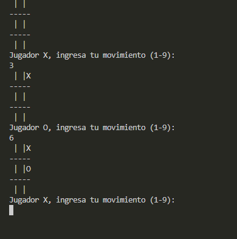
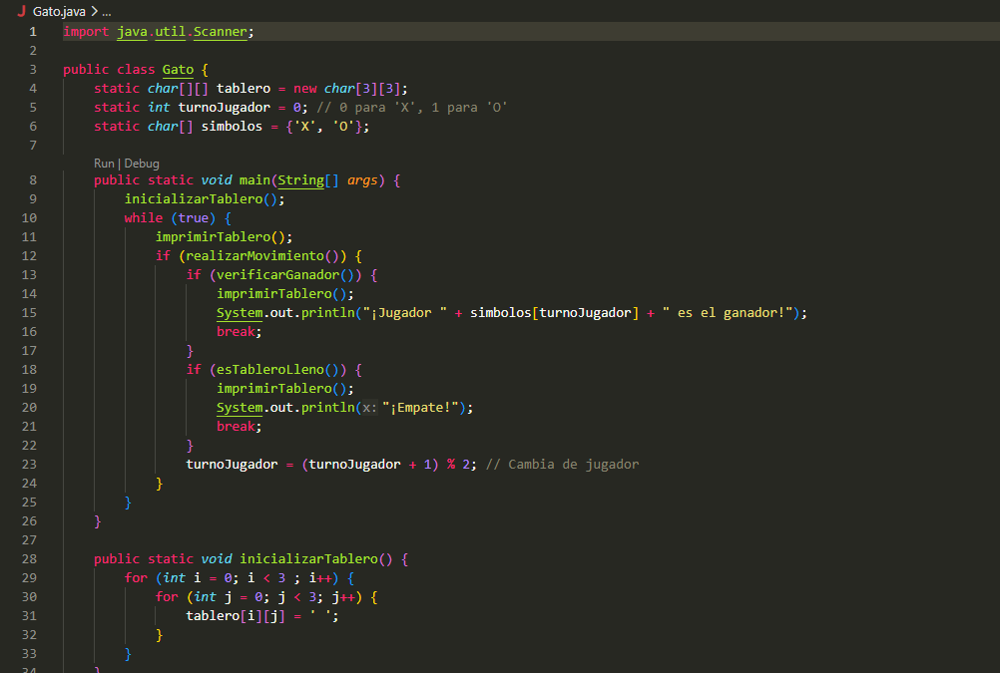

# Juego del Gato (Tres en Raya) en Java

## Creador

**Joaquín Dávila**

## Descripción

Juego del gato para dos jugadores que se juega por consola, desarrollado en Java como proyecto académico en la Universidad de Sonora (UNISON). Los jugadores se turnan para colocar su símbolo (`X` u `O`) en un tablero de 3x3. Gana quien complete una fila, columna o diagonal, y si el tablero se llena sin ganador, el juego termina en empate.

## ¿Cómo funciona?

- El tablero es una matriz de `3x3` que empieza vacía. Se imprime en consola antes de cada turno.
- El jugador `X` siempre empieza, y después se alternan los turnos con `O`.
- En cada turno, el programa pide un número del **1 al 9**. Las casillas se numeran de izquierda a derecha y de arriba hacia abajo:

```
1|2|3
-----
4|5|6
-----
7|8|9
```

- Si la casilla está libre, se coloca el símbolo y pasa el turno al otro jugador. Si el número no es válido o la casilla ya está ocupada, el programa muestra `Movimiento inválido.` y el mismo jugador vuelve a intentarlo.
- Después de cada movimiento válido, el programa revisa si hay ganador (3 en fila, columna o diagonal) y si el tablero está lleno (empate). Si ocurre alguna de las dos cosas, muestra el tablero final con el resultado y termina.

## Requisitos

- Java JDK 8 o superior.
- Una terminal (o VS Code con la extensión de Java).

## Cómo correrlo

1. Clona el repositorio:
```bash
   git clone https://github.com/Joaquin-Davila/<nombre-del-repositorio>.git
   cd <nombre-del-repositorio>
```
2. Compila el programa:
```bash
   javac Gato.java
```
3. Ejecútalo:
```bash
   java Gato
```
4. Escribe el número de la casilla (1-9) cuando el programa te lo pida y presiona Enter.

## Imágenes

### Partida en ejecución


### Código fuente


## Estructura del proyecto

```
<nombre-del-repositorio>/
├── Gato.java
├── imagenes/
│   ├── ejecucion.png
│   └── codigo.png
└── README.md
```
